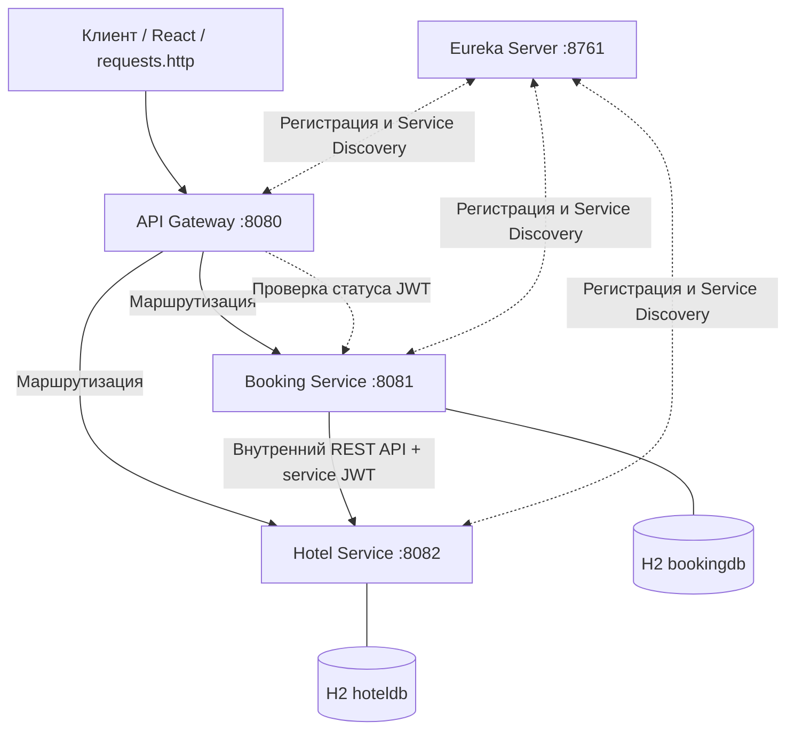
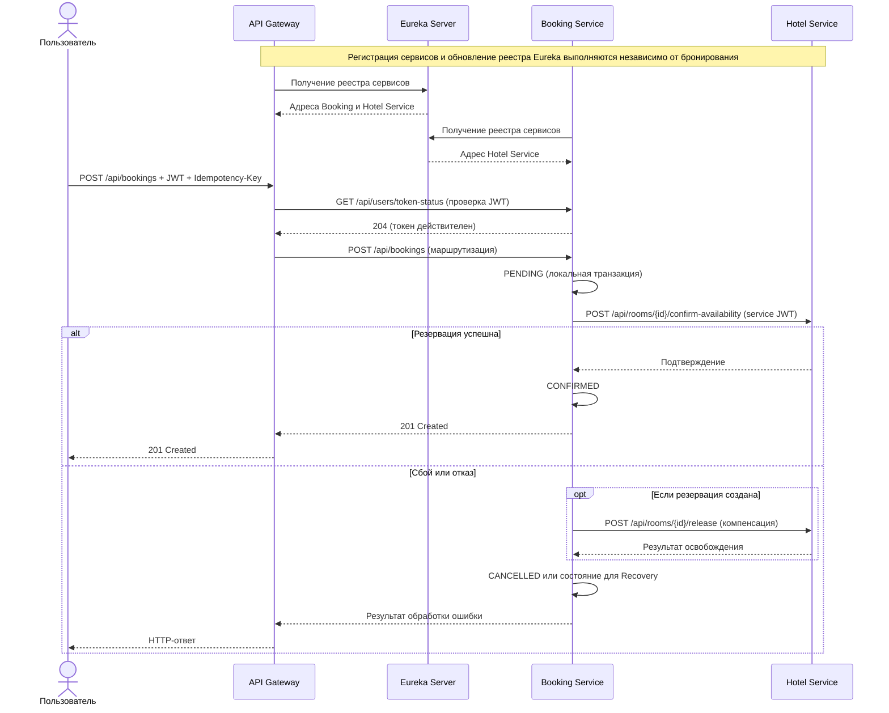

# Hotel Booking System

Распределённая система бронирования отелей с REST API и React-клиентом. Backend реализован на Java 17, Spring Boot 4.1.1 и Spring Cloud. Система включает управление пользователями, отелями и номерами, подбор свободных номеров по датам и согласованное бронирование между микросервисами.

## Возможности

- Регистрация и вход, JWT с временем жизни 1 час; роли `USER`, `ADMIN`, отдельная служебная авторизация между микросервисами.
- CRUD отелей, номеров и пользователей; фотографии, удобства, фильтры, пагинация, статистика.
- Ручной выбор номера (`autoSelect=false`) или автоподбор (`autoSelect=true`); `LEAST_BOOKED` по умолчанию и дополнительная стратегия `MOST_EXPENSIVE`. При автоподборе явно переданная `strategy` имеет приоритет над настройкой отеля.
- Идемпотентное создание бронирований с `Idempotency-Key`, контроль конфликтов дат и защита от конкурентного бронирования.
- Saga: подтверждение бронирования между Booking Service и Hotel Service, компенсация при сбоях, автоматическое и административное восстановление.
- Корреляция `traceId`, обработка ошибок, Retry/Timeout/Circuit Breaker, unit/integration/E2E и нагрузочные сценарии.

## Возможности сверх базового ТЗ

Помимо обязательных микросервисов, JWT, Saga и алгоритма подбора `LEAST_BOOKED`, реализованы дополнительные функции:

- **Веб-интерфейс на React:** каталог отелей, подбор и бронирование номеров, личный кабинет, административные страницы и пошаговые мастера управления отелями и номерами.
- **Расширенное управление пользователями:** профили с контактными данными, самостоятельная смена пароля, административный поиск, изменение ролей и сброс пароля с обязательной сменой при следующем входе. Предусмотрена защита от удаления последнего администратора, самоудаления и самостоятельного понижения роли.
- **Дополнительная защита:** досрочный отзыв JWT при изменении состояния пользователя, проверка статуса токена через Gateway, Rate Limiting для регистрации, входа и чувствительных административных операций, ограничение повторных неудачных входов.
- **Расширенный каталог:** описания и рейтинги отелей, удобства, категории и вместимость номеров, цены, фотографии отелей и номеров. Галереи поддерживают главное изображение, порядок фотографий и безопасную выдачу файлов JPEG, PNG и WebP.
- **Дополнительная стратегия подбора:** `MOST_EXPENSIVE` наряду с обязательной `LEAST_BOOKED`; стратегия задаётся для отеля администратором и может быть переопределена параметром `strategy` при автоматическом подборе. Без переопределения применяется настройка отеля (`LEAST_BOOKED` по умолчанию).
- **Расширенное восстановление:** автоматический и административный повтор незавершённых Saga, управление повторными попытками и компенсацией; при откате инициализации демоданных компенсируются также операции с файлами фотографий.

## Технологии

| Область | Реализация |
|---|---|
| Язык и сборка | Java 17; Gradle Kotlin DSL / Wrapper |
| Backend | Spring Boot 4.1.1; Spring Cloud 2025.1.3 |
| REST и API | Spring Web MVC; Spring Cloud Gateway WebFlux; springdoc-openapi 3.1.1, Swagger UI |
| Обнаружение | Spring Cloud Netflix Eureka |
| Данные | Spring Data JPA / Hibernate; независимые H2 in-memory; локальные `@Transactional` |
| Безопасность | Spring Security Resource Server, JWT, `@PreAuthorize` |
| Надёжность | Spring Retry (`@Retryable`), Resilience4j Circuit Breaker |
| Проверка | JUnit, Spring Test, MockMvc и E2E |

## Архитектура


```mermaid
flowchart TB
    Client["Клиент / React / requests.http"] --> GW["API Gateway :8080"]

    GW -->|"Маршрутизация"| BS["Booking Service :8081"]
    GW -->|"Маршрутизация"| HS["Hotel Service :8082"]
    GW -.->|"Проверка статуса JWT"| BS
    BS -->|"Внутренний REST API + service JWT"| HS

    BS --- BDB[("H2 bookingdb")]
    HS --- HDB[("H2 hoteldb")]

    E["Eureka Server :8761"]
    E <-.->|"Регистрация и Service Discovery"| GW
    E <-.->|"Регистрация и Service Discovery"| BS
    E <-.->|"Регистрация и Service Discovery"| HS
```

| Модуль | Ответственность | Порт |
|---|---|---:|
| `discovery-server` | Реестр Eureka | 8761 |
| `api-gateway` | Внешняя маршрутизация, фильтры безопасности, корреляция | 8080 |
| `booking-service` | Пользователи, JWT, брони, Saga и восстановление | 8081 |
| `hotel-service` | Отели, номера, фотографии, резервации, статистика, подбор | 8082 |

Оба бизнес-сервиса используют **собственные** in-memory БД. Запросы клиентов направляются через Gateway (`/api/users/**`, `/api/bookings/**`, `/api/hotels/**`, `/api/rooms/**`). Защищённые внутренние операции `confirm-availability`/`release` не предназначены для внешнего использования и блокируются политикой Gateway. Подробности: [модули](docs/modules.md), [ADR-001](docs/adr/001-microservices.md), [ADR-002](docs/adr/002-security.md).

## Требования к окружению

- JDK 17 или совместимый JDK; установленный Java в `PATH`/`JAVA_HOME`.
- Свободные порты `8761`, `8080`, `8081`, `8082`.
- Интернет при **первом** запуске Gradle Wrapper для загрузки дистрибутива Gradle и зависимостей (после заполнения кеша Gradle возможна офлайн-сборка).
- **Docker и PostgreSQL не требуются** для этого варианта проекта.

## Настройка секретов

Для Booking Service обязательны переменные окружения и параметры, перечисленные ниже (учётные данные демопользователей и администратора — необязательные):

| Имя | Назначение |
|---|---|
| `JWT_KEYSTORE_PATH` | Путь к PKCS#12 keystore пользовательского JWT |
| `JWT_KEYSTORE_PASSWORD` | Пароль хранилища |
| `SERVICE_JWT_KEYSTORE_PATH` | Путь к отдельному PKCS#12 keystore для service JWT |
| `SERVICE_JWT_KEYSTORE_PASSWORD` | Пароль служебного хранилища |
| `GATEWAY_INTERNAL_SECRET` | Секрет доверенного взаимодействия Gateway/сервисов; согласовать значение между компонентами, которые его используют |
| `ADMIN_EMAIL`, `ADMIN_PASSWORD` | Необязательная инициализация администратора |
| `DEMO_USER_1_PASSWORD`, `DEMO_USER_2_PASSWORD` | Необязательные пароли демопользователей |

**Каталоги фотографий (Hotel Service).** Переменная `HOTEL_PHOTOS_DIR` задаёт путь к фотографиям отелей; по умолчанию используется `storage/hotels` (`app.photos.directory` в `hotel-service/src/main/resources/application.yml`). Фотографии номеров используют отдельное свойство `app.room-photos.directory`, по умолчанию `storage/rooms`; его считывают `RoomPhotoService` и `DemoHotelsInitializer`. При необходимости другой каталог для номеров задаётся в VM options **Hotel Service**: `-Dapp.room-photos.directory=<абсолютный-путь>`. Оба относительных пути отсчитываются от рабочей директории процесса Hotel Service, а не Booking Service.

Создать keystore можно утилитой JDK `keytool` (пример для тестовой среды):

```powershell
keytool -genkeypair -alias jwt-signing -keyalg RSA -keysize 3072 -sigalg SHA256withRSA -storetype PKCS12 -keystore user-jwt.p12 -validity 365 -dname "CN=hotel-booking-user"
keytool -genkeypair -alias service-jwt-signing -keyalg RSA -keysize 3072 -sigalg SHA256withRSA -storetype PKCS12 -keystore service-jwt.p12 -validity 365 -dname "CN=hotel-booking-service"
```

`keytool` предложит пароль для каждого хранилища. Алиасы `jwt-signing` и `service-jwt-signing` должны совпадать с `app.jwt.keystore.alias` и `app.jwt.service-keystore.alias` в Booking Service. После создания новых ключей **обязательно экспортируйте их публичные X.509-сертификаты**, поскольку API Gateway и Hotel Service проверяют подписанные токены по файлам `.crt`, а не по приватным keystore:

```powershell
# Выполняется из корня проекта, там же, где созданы user-jwt.p12 и service-jwt.p12
keytool -exportcert -rfc -storetype PKCS12 -alias jwt-signing -keystore user-jwt.p12 -file jwt-signing.crt
keytool -exportcert -rfc -storetype PKCS12 -alias service-jwt-signing -keystore service-jwt.p12 -file service-jwt-signing.crt

# Пользовательский JWT проверяют Gateway и Hotel Service
Copy-Item .\jwt-signing.crt .\api-gateway\src\main\resources\jwt-signing.crt -Force
Copy-Item .\jwt-signing.crt .\hotel-service\src\main\resources\jwt-signing.crt -Force

# Служебный JWT проверяет Hotel Service
Copy-Item .\service-jwt-signing.crt .\hotel-service\src\main\resources\service-jwt-signing.crt -Force
```

Укажите `JWT_KEYSTORE_PATH` и `SERVICE_JWT_KEYSTORE_PATH` (пути к соответствующим `.p12`) и их пароли **в окружении Booking Service**. Для путей безопаснее использовать абсолютные значения. `GATEWAY_INTERNAL_SECRET` задайте одинаковым в Gateway, Booking Service и Hotel Service. При запуске из IntelliJ IDEA используйте **Environment variables** соответствующих Run Configurations, при запуске через терминал — окружение запускаемых процессов. После замены сертификатов перезапустите Gateway и Hotel Service, а Booking Service запустите с соответствующими новыми keystore; ранее подписанные старыми ключами JWT перестанут проходить проверку.

API Gateway проверяет JWT и добавляет служебный заголовок `X-Gateway-Internal-Secret`, который используется backend-сервисами для защиты от прямого обращения. Gateway также передаёт проверенный IP клиента через `X-Verified-Client-IP`. Секретные значения не должны передаваться пользователями вручную.

## Конфигурации запуска в IntelliJ IDEA

В меню **Run → Edit Configurations** создайте четыре конфигурации типа **Spring Boot** (кнопка **+**). Выберите **JDK 17**, модуль и главный класс из таблицы. Для Booking и Hotel укажите `-Dspring.profiles.active=dev` в поле **VM options** (если поле скрыто — **Modify options → Add VM options**).

| Конфигурация | Module (Use classpath of module) | Main class | VM options |
|---|---|---|---|
| `DiscoveryServerApplication` | `hotel-booking-system.discovery-server.main` | `com.hotelbooking.discovery.DiscoveryServerApplication` | — |
| `GatewayApplication` | `hotel-booking-system.api-gateway.main` | `com.hotelbooking.gateway.GatewayApplication` | — |
| `HotelServiceApplication` | `hotel-booking-system.hotel-service.main` | `com.hotelbooking.hotel.HotelServiceApplication` | `-Dspring.profiles.active=dev` |
| `BookingServiceApplication` | `hotel-booking-system.booking-service.main` | `com.hotelbooking.booking.BookingServiceApplication` | `-Dspring.profiles.active=dev` |

В поле **Environment variables** настройте:

| Конфигурация | Переменные окружения |
|---|---|
| Discovery Server | Не требуются |
| API Gateway | `GATEWAY_INTERNAL_SECRET` |
| Hotel Service | `GATEWAY_INTERNAL_SECRET`, `APP_DEMO_ENABLED=true`, `HOTEL_PHOTOS_DIR=$PROJECT_DIR$/storage/hotels`; для фото номеров при необходимости добавьте в **VM options** `-Dapp.room-photos.directory=<абсолютный-путь>` |
| Booking Service | `GATEWAY_INTERNAL_SECRET`, `JWT_KEYSTORE_PATH`, `JWT_KEYSTORE_PASSWORD`, `SERVICE_JWT_KEYSTORE_PATH`, `SERVICE_JWT_KEYSTORE_PASSWORD`, `APP_DEMO_ENABLED=true`, `ADMIN_EMAIL`, `ADMIN_PASSWORD`, `DEMO_USER_1_PASSWORD`, `DEMO_USER_2_PASSWORD` |

`GATEWAY_INTERNAL_SECRET` должен иметь **одно и то же значение** в Gateway, Hotel и Booking. `JWT_KEYSTORE_PATH` и `SERVICE_JWT_KEYSTORE_PATH` указывают на PKCS#12-файлы Booking Service; публичные сертификаты из этих хранилищ должны быть экспортированы и размещены в Gateway/Hotel Service, как показано выше. Пароли и сами секреты в README не приводятся. После настройки запускайте сервисы в порядке Eureka → Gateway → Hotel → Booking.

**E2E All:** отдельная конфигурация **JUnit** для модуля `hotel-booking-system.booking-service.test`, с **JDK 17**, выбором **All in package** → `com.hotelbooking.booking.e2e`, **VM options** `-ea -Dhotel.e2e=true` и **Working directory** `$MODULE_WORKING_DIR$`. Четыре сервиса должны быть запущены. Подробности, в том числе сценарии Saga Fault и файл локальных ADMIN-параметров, приведены в [документации тестирования](docs/testing.md).

## Сборка и запуск

Из корня репозитория:

```powershell
# Windows PowerShell
.\gradlew.bat clean test
```

```bash
# macOS / Linux
chmod +x ./gradlew
./gradlew clean test
```

В отдельных терминалах/Run Configurations запускайте в порядке:

```powershell
.\gradlew.bat :discovery-server:bootRun
.\gradlew.bat :api-gateway:bootRun
.\gradlew.bat :hotel-service:bootRun
.\gradlew.bat :booking-service:bootRun
```

На macOS/Linux используйте `./gradlew` вместо `.\gradlew.bat`. Дождитесь регистрации Gateway, Booking и Hotel в Eureka: `http://localhost:8761/`. При холодном старте discovery короткие `503` возможны до регистрации сервисов. HTTP-запросы для ручной проверки находятся в `test/manual/requests.http`; основной прогон и дополнительные сценарии Rate Limiting выполняются раздельно по инструкции в файле.

## Использование API

Базовый адрес: `http://localhost:8080`. Самые важные маршруты:

| HTTP | Маршрут | Назначение |
|---|---|---|
| POST | `/api/users/register` | Регистрация |
| POST | `/api/users/login` | Получение JWT |
| GET | `/api/users/me` | Профиль |
| GET | `/api/hotels` | Список отелей |
| GET | `/api/rooms?hotelId=1` | Номера отеля с фильтрами/пагинацией |
| GET | `/api/rooms/recommend?hotelId=1&checkIn=2026-11-15&checkOut=2026-11-18` | Рекомендации |
| POST | `/api/bookings` | Бронирование (JWT + `Idempotency-Key: <UUID>`) |
| GET | `/api/bookings/my` | Личная история |
| GET | `/api/bookings/{id}` | Получение брони |
| PATCH | `/api/bookings/{id}/cancel` | Отмена брони |
| GET | `/api/hotels/{hotelId}/statistics` | Статистика |

Зарегистрируйте пользователя, затем выполните вход и используйте `Authorization: Bearer <JWT>` для защищённых запросов. Пример тела `POST /api/bookings` для **ручного** выбора:

```json
{
  "roomId": 1,
  "autoSelect": false,
  "checkIn": "2026-11-15",
  "checkOut": "2026-11-18",
  "guestCount": 2
}
```

При `autoSelect: true` укажите `hotelId` вместо `roomId`. Если параметр `strategy` не задан, используется стратегия отеля (`LEAST_BOOKED` по умолчанию); пользователь также может явно указать `LEAST_BOOKED` или `MOST_EXPENSIVE`. При `autoSelect: false` поле `strategy` не влияет на ручной выбор. Даты должны соответствовать правилам валидации (заезд сегодня или позже, выезд позднее заезда). Полный контракт см. в [описании API](docs/api.md).

## Swagger / OpenAPI

В Booking Service и Hotel Service подключён springdoc-openapi. Документация формируется по REST-контроллерам и DTO. Для защищённых запросов предусмотрена схема HTTP Bearer JWT.

| Сервис | Swagger UI | OpenAPI JSON |
|---|---|---|
| Booking Service | `http://localhost:8081/swagger-ui.html` | `http://localhost:8081/v3/api-docs` |
| Hotel Service | `http://localhost:8082/swagger-ui.html` | `http://localhost:8082/v3/api-docs` |

Откройте Swagger UI, нажмите **Authorize** и вставьте JWT, полученный через `/api/users/login`. Регистрация и вход доступны без JWT. Служебные операции бронирования номеров исключены из публичной спецификации Hotel Service через `@Hidden`. Страницы Swagger открываются напрямую на портах соответствующих сервисов; защищённые REST-операции продолжают проверять авторизацию.

## Бронирование и согласованность


```mermaid
sequenceDiagram
    actor U as Пользователь
    participant G as API Gateway
    participant E as Eureka Server
    participant B as Booking Service
    participant H as Hotel Service

    Note over G,H: Регистрация сервисов и обновление реестра Eureka выполняются независимо от бронирования
    G->>E: Получение реестра сервисов
    E-->>G: Адреса Booking и Hotel Service
    B->>E: Получение реестра сервисов
    E-->>B: Адрес Hotel Service

    U->>G: POST /api/bookings + JWT + Idempotency-Key
    G->>B: GET /api/users/token-status (проверка JWT)
    B-->>G: 204 (токен действителен)
    G->>B: POST /api/bookings (маршрутизация)
    B->>B: PENDING (локальная транзакция)
    B->>H: POST /api/rooms/{id}/confirm-availability (service JWT)

    alt Резервация успешна
        H-->>B: Подтверждение
        B->>B: CONFIRMED
        B-->>G: 201 Created
        G-->>U: 201 Created
    else Сбой или отказ
        opt Если резервация создана
            B->>H: POST /api/rooms/{id}/release (компенсация)
            H-->>B: Результат освобождения
        end
        B->>B: CANCELLED или состояние для Recovery
        B-->>G: Результат обработки ошибки
        G-->>U: HTTP-ответ
    end
```

Идемпотентный ключ запрещает создавать повторную бронь из повторной доставки одного и того же запроса. Hotel Service проверяет занятость **по интервалам дат**, а `available` служит операционным признаком номера (например, вывод из эксплуатации). Для действующих подтверждённых броней `timesBooked` увеличивается; при корректной отмене уменьшается без повторного списания. См. [ADR-003](docs/adr/003-distributed-booking.md), [ADR-004](docs/adr/004-room-selection.md), [ADR-006](docs/adr/006-saga-recovery.md).

## Тестирование

Проект включает модульные (Unit), интеграционные (Integration) и сквозные (E2E) тесты.

**Модульные и интеграционные тесты** запускаются из корня проекта командой:

```powershell
.\gradlew.bat clean test
```

**E2E-тестирование** выполняется через конфигурацию `E2E All` в IntelliJ IDEA при работающих Eureka Server, API Gateway, Hotel Service и Booking Service. Для изоляции повторных прогонов используется перезапуск сервисов со сбросом данных H2 in-memory.

Автоматизированные тесты охватывают:

- Регистрацию, аутентификацию и разграничение прав доступа (401/403).
- Проверку конфликтов бронирования (409), параллельных запросов и идемпотентности.
- Работу алгоритмов подбора номеров.
- Сбои Hotel Service, Retry, Timeout и Circuit Breaker.
- Подтверждение, компенсацию и восстановление Saga (Recovery).
- Корректность учёта бронирований в `timesBooked`.

Unit- и E2E-наборы выполняются раздельно; методика и условия их запуска описаны в `docs/testing.md`.

Подробности: [тестирование](docs/testing.md).

## Проверка качества кода

Для статического анализа и поддержания единого стиля Java-кода используются **Checkstyle**, **SpotBugs** и **Spotless**:

- **Checkstyle** — проверка соглашений по оформлению исходного кода.
- **SpotBugs** — выявление потенциальных дефектов в скомпилированном Java-коде.
- **Spotless** — проверка и автоматическое форматирование исходников.

Запуск анализаторов и проверки форматирования во всех микросервисах из корня проекта:

```powershell
.\gradlew.bat checkstyleMain spotbugsMain spotlessJavaCheck
```

Команда не запускает JUnit и E2E-тесты и не изменяет исходные файлы. `checkstyleMain` и `spotbugsMain` анализируют основной Java-код; `spotlessJavaCheck` также проверяет форматирование тестовых Java-файлов.

Для автоматического форматирования:

```powershell
.\gradlew.bat spotlessApply
```

`spotlessApply` изменяет Java-файлы, в том числе тесты и E2E, поэтому изменения следует проверить перед коммитом.

## Документация

- [Описание модулей](docs/modules.md)
- [REST API](docs/api.md)
- [Swagger и OpenAPI](docs/swagger.md)
- [Модель данных](docs/database.md)
- [Тестирование и демонстрация](docs/testing.md)
- [Реестр ADR](docs/adr/README.md) — 7 архитектурных решений

## Ограничения и эксплуатационные особенности

- `H2 in-memory` и `ddl-auto: create-drop`: после рестарта содержимое БД теряется; это требование учебной версии.
- Фотографии хранятся в локальной файловой системе. См. [ADR-007](docs/adr/007-photo-storage.md).
- Локальные in-memory механизмы ограничения частоты запросов не являются распределённым лимитером на несколько экземпляров.
